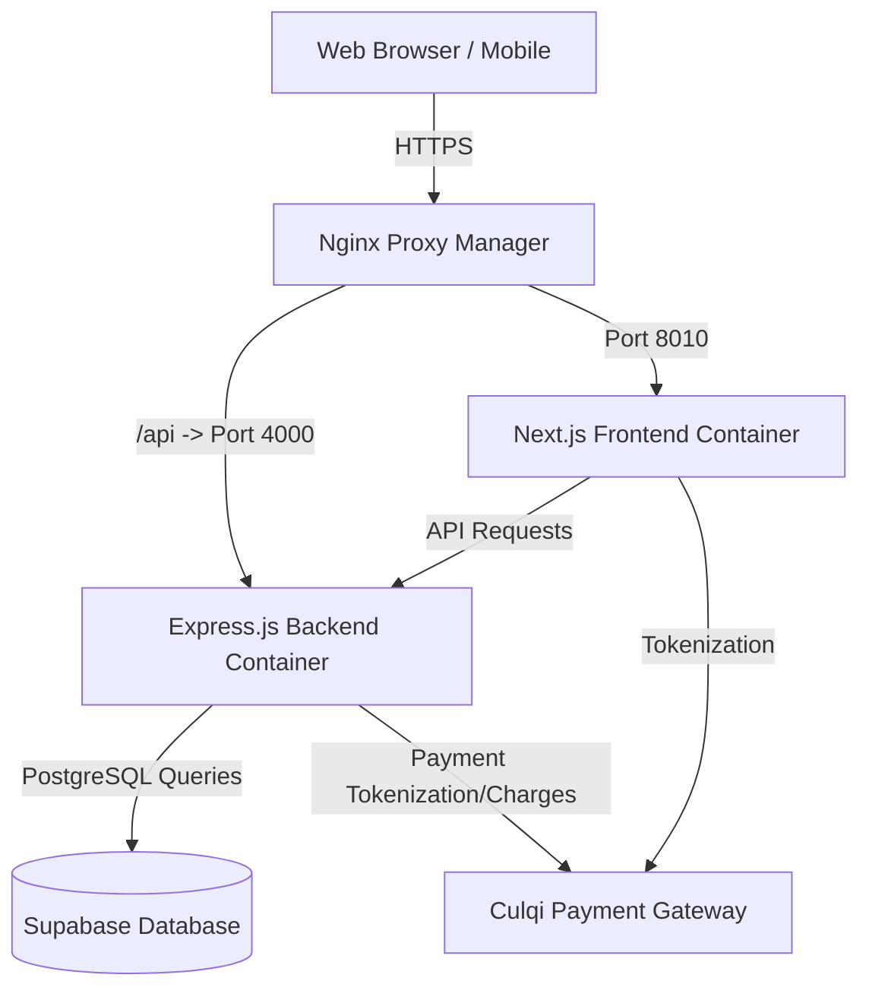

# Software Architecture Documentation
## Matteo Salvatore E-commerce

This document outlines the high-level software architecture, technology stack, directory structure, data model, and deployment strategy for the Matteo Salvatore E-commerce platform.

---

## 1. Technology Stack

### Frontend
- **Framework**: Next.js 14 (App Router)
- **Styling**: Tailwind CSS 3.4 + CSS Variables
- **State Management**: Zustand + React Query
- **Form Handling**: React Hook Form + Zod
- **Rich Text Editor**: React Quill
- **Components/Icons**: Lucide React, Framer Motion
- **Internationalization (i18n)**: next-intl
- **Language**: TypeScript

### Backend
- **Framework**: Node.js 22 + Express.js
- **Database**: PostgreSQL (managed via Supabase)
- **ORM / DB Client**: Supabase JS Client (`@supabase/supabase-js`)
- **Payment Gateway**: Culqi (Peru)
- **Security**: Helmet, CORS, Express Rate Limit
- **Logging**: Winston
- **Language**: JavaScript

### Infrastructure & Operations
- **Containerization**: Docker + Docker Compose (Node 22 Alpine images)
- **Hosting**: VPS Hosted Setup (Hostinger)
- **Reverse Proxy**: Nginx Proxy Manager (NPM)
- **SSL**: Let's Encrypt (auto-renewable)
- **CI/CD**: GitHub Actions (or deployment scripts via SSH)

---

## 2. System Architecture

The system follows a modern, decoupled client-server architecture.



---

## 3. Data Model (Supabase PostgreSQL)

The core database consists of the following primary tables and relationships:

### Core Tables
- **`products`**: Central catalog holding base product information (SKU, multi-language names & descriptions using React Quill HTML, pricing, category).
- **`product_variants`**: Specific options for a product (Size, Color, Stock). Links to `products` via `product_id`.
- **`product_images`**: Media gallery associated with products.
- **`categories`** / **`product_categories`**: Multi-level taxonomy connecting products to specific hierarchical categories.
- **`customers`**: Holds user profiles and authentication details.
- **`addresses`**: Connects multiple shipping/billing addresses to a `customer_id`.
- **`orders`**: Transaction records linking `customer_id` and order statuses.
- **`order_items`**: Individual line items detailing which `product_id` and `variant_id` were purchased in a specific `order_id`.
- **`cart`**: Persistent shopping cart associated with a `session_id` or `customer_id`.
- **`payments`**: Records tracking transactions through the Culqi gateway, linking to `order_id`.

---

## 4. Directory Structure

The repository is structured as a monorepo containing both the Next.js frontend and Express backend.

```text
matteo-salvatore-ecommerce/
│
├── frontend/                    # Next.js App (Port 3000 Local / 8010 Prod)
│   ├── app/
│   │   ├── [lang]/              # i18n routing (en/es)
│   │   │   ├── admin/           # Secured Admin Dashboard
│   │   │   │   ├── orders/      # Order management
│   │   │   │   ├── products/    # Product CRUD (with React Quill)
│   │   │   │   └── settings/    # Platform settings
│   │   │   ├── (shop)/          # Publicly accessible Storefront routes
│   │   │   │   ├── products/    # Product details (PDP) & catalogs (PLP)
│   │   │   │   └── category/    # Category browsing
│   ├── components/              # Reusable React components (Admin, UI, Layout)
│   ├── dictionaries/            # i18n translation JSON strings
│   ├── lib/
│   │   └── api/                 # Axios API clients talking to backend
│   ├── store/                   # Zustand global state (e.g., useCart)
│   ├── middleware.ts            # Next.js Middleware (Admin auth & i18n)
│   └── Dockerfile               # Node 22 Alpine Build
│
├── backend/                     # Express API (Port 4000)
│   ├── src/
│   │   ├── controllers/         # Business logic (cart, orders, products)
│   │   ├── routes/              # Express Router definitions
│   │   ├── services/            # External integrations (Supabase, Culqi)
│   │   └── app.js               # Express application initialization (Rate limits, CORS)
│   └── Dockerfile               # Node 22 Alpine Build
│
├── database/                    # SQL schema definitions and migrations
├── scripts/                     # Automation tasks (e.g., deploy.sh)
├── docker-compose.yml           # Local development composition
└── docker-compose.prod.yml      # Production composition
```

---

## 5. Deployment Strategy

The application is deployed on a Linux VPS using Docker Compose.

### Production Environment Variables
A `.env` file must exist in the root of the VPS mapping the `production.env` keys. Critical variables include:
- `NEXT_PUBLIC_API_URL` (Must point to the public Nginx proxy, e.g., `https://matteosalvatore.pe/api`)
- `SUPABASE_URL` & `SUPABASE_KEY`
- `CULQI_PRIVATE_KEY` & `NEXT_PUBLIC_CULQI_PUBLIC_KEY`

### Deployment Workflow
1. **Source Control Check**: Code is committed and pushed to the `main` branch.
2. **Execution**: The deployment script (`scripts/deploy.sh`) is executed on the VPS.
3. **Synchronization**: The script fetches the latest Git commit using `git reset --hard origin/main`.
4. **Rebuild**: Docker containers are rebuilt forcefully using `docker-compose -f docker-compose.prod.yml build --no-cache`.
5. **Restart**: The old containers are spun down and the newly built `node:22-alpine` containers are spun up dynamically.

### Routing / Proxy Manager
Nginx Proxy Manager acts as the gatekeeper, configured with SSL certificates via Let's Encrypt.
- Standard traffic (`/`) is routed to the `frontend` container (Port 8010).
- API traffic (`/api/*`) is routed via a Custom Location rule to the `backend` container (Port 4000).
