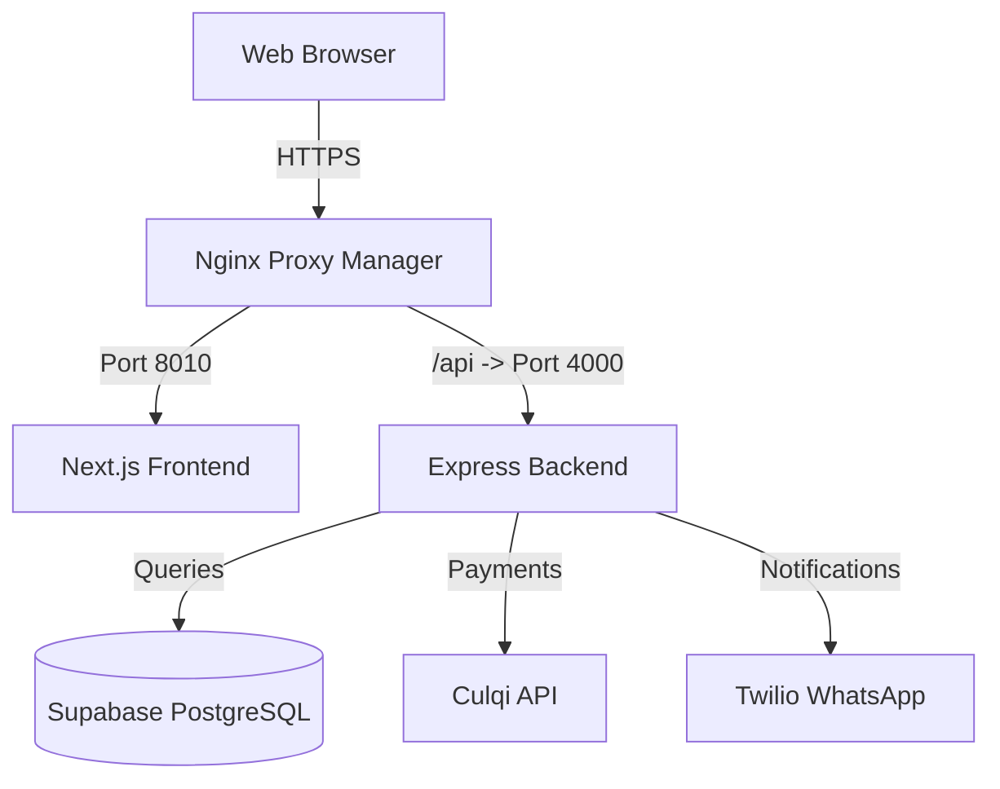

# Software Architecture Documentation / Documentación de Arquitectura de Software
## Matteo Salvatore E-commerce

This document outlines the high-level software architecture, technology stack, data model, and deployment strategy for the Matteo Salvatore E-commerce platform.

Este documento describe la arquitectura de software de alto nivel, el stack tecnológico, el modelo de datos y la estrategia de despliegue para la plataforma de comercio electrónico de Matteo Salvatore.

---

## 1. Technology Stack / Stack Tecnológico

### Frontend
- **Framework**: Next.js 14 (App Router)
- **Styling / Estilos**: Tailwind CSS 3.4
- **State Management / Estado**: Zustand
- **Languages / Idiomas**: TypeScript, i18next (via `next-intl` concept)

### Backend
- **Runtime**: Node.js 22
- **Framework**: Express.js
- **Database / Base de Datos**: PostgreSQL (Supabase)
- **API**: RESTful endpoints
- **Integrations / Integraciones**: Culqi (Payments), Supabase (Auth/Storage), Twilio (WhatsApp)

---

## 2. System Overview / Resumen del Sistema

The application follows a modern decoupled architecture with a Next.js frontend and an Express.js backend, both running in Docker containers.

La aplicación sigue una arquitectura desacoplada moderna con un frontend en Next.js y un backend en Express.js, ambos ejecutándose en contenedores Docker.

---

## 3. Data Model / Modelo de Datos

Key tables in the database / Tablas principales en la base de datos:

| Table / Tabla | Description / Descripción |
| :--- | :--- |
| `products` | Core product information (ES/EN) / Información central de productos. |
| `product_variants` | Sizes, colors, and stock / Tallas, colores y stock. |
| `product_categories` | Hierarchical taxonomy / Taxonomía jerárquica. |
| `menu_items` | Dynamic navigation builder structure / Estructura del constructor de menús. |
| `orders` | Transaction records and shipping / Registros de transacciones y envíos. |
| `customers` | User profiles and preferences / Perfiles de usuario y preferencias. |

---

## 4. Key Features / Funcionalidades Clave

### Menu Builder / Constructor de Menú
- **Internal Reorganization**: Drag-and-drop support for reordering and nesting items.
- **Reorganización Interna**: Soporte para arrastrar y soltar para reordenar y anidar elementos.

### Localized Slugs / Slugs Localizados
- **SEO Optimization**: Categories support `slug_es` and `slug_en` for better indexing.
- **Optimización SEO**: Las categorías soportan `slug_es` y `slug_en` para una mejor indexación.

---

## 5. Deployment / Despliegue

The system is deployed on a VPS using Docker Compose. Routing is handled by Nginx Proxy Manager with automatic SSL certificates from Let's Encrypt.

El sistema se despliega en un VPS usando Docker Compose. El enrutamiento es manejado por Nginx Proxy Manager con certificados SSL automáticos de Let's Encrypt.
